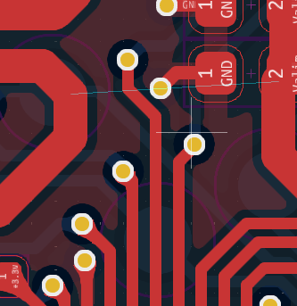
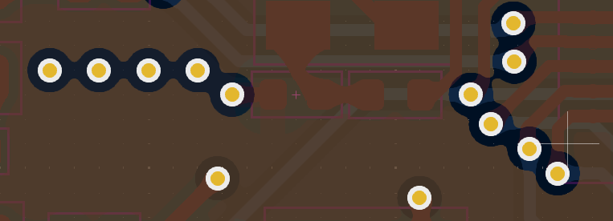
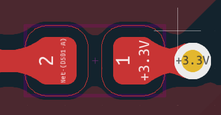
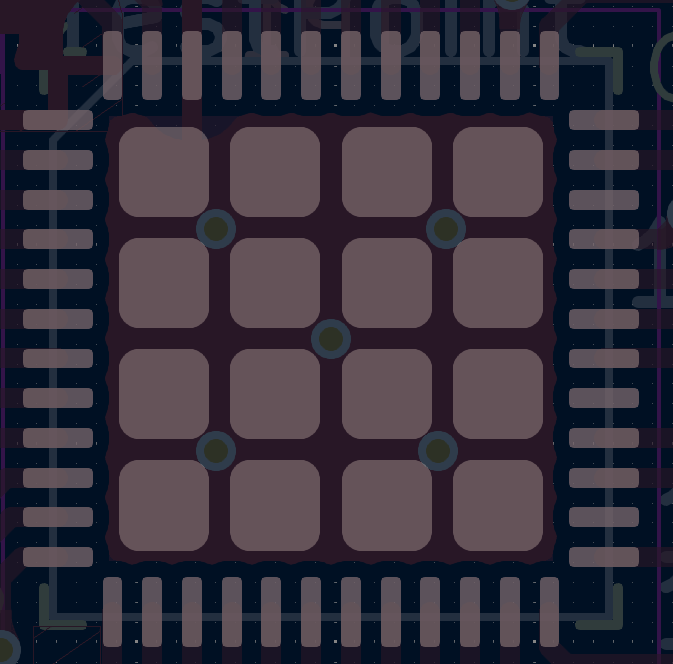

# 2425_ESE_Project_TagBot
Welcome to the TagBot project created by the amazing team consisted of Lucas Chapart, Charlotte Fricot and Marie Caronello.
The following description is in french but you can find the english description there :

- [English](README_english.md)

  # Sommaire
  
1. [Introduction](#introduction)
2. [PCB](#pcb)
3. [Code](#code)

  
  # Introduction
  
Vous vous trouvez actuellement dans le projet TagBot (ou robot chat), qui s'intègre à un projet de classe où chaque équipe doit concevoir un robot. Ces robots doivent pouvoir jouer au chat ensemble, avec un chat et des souris, sur une table sans bords. 
  
Au terme de ce projet, notre chat robot doit pouvoir:
 - se déplacer sur une table sans bordure (sans tomber)
 - changer d'état (chat ou souris)
  - si le robot est chat, il doit pouvoir attraper la souris
  - si le robot est souris, il doit pouvoir échapper au chat
  
Nous avons plusieurs niveaux d'objectifs à atteindre : 
  - Niveau 0 : le robot se déplace + ne tombe pas de la table
  - Niveau 1 : détection d'un robot et s'en rapprocher (chat) ou s'en éloigner (souris)
  - Niveau 2 : changement de comportement après un contact + fonctionnement avec plusieurs robots
  - Niveau 3 : capacité de se localiser + ne pas être affecté par les obstacles hors de la table

  Le projet doit être réalisé sur un semestre, du mois de septembre au mois de janvier, avec un certain nombre de livrables à fournir avant chaque étape clé. Les   différentes étapes techniques incluent des phases de conception, de développement et de validation sur un système embarqué.

  

  
<strong>Plan détaillé</strong>
  

  ### Avant les vacances de la Toussaint
  
  Les 10 premières séances sont consacrées à la création du PCB que l'on doit commander avant les vacances de la Toussaint. 
  
  - Séance 1 → Schéma architectural / BOM
  - Séance 2 et 3 → Schéma électronique annoté
  - Séance 4 → Corrections Schéma / BOM Finale
  - Séance 5 → Placement
  - Séance 6 → Placement corrigé
  - Séance 7 → Routage
  - Séance 8, 9 et 10 → Corrections Routage, export

  Dans le même temps, nous avons débuté la partie informatique avec la création du projet sur CubeIDE. Nous avons configuré les pins et commencé la rédaction des librairies pour les différents composants. 

  ### Entre la Toussaint et Noël

  Cette période est centrée sur le développement logiciel et l'intégration.

  ### Après les vacances de Noël

  L'accent est mis sur les derniers ajustements et les tests finaux avant la présentation. En effet, les dernières séances consacrées à ce projet vont nous permettre de finaliser les algorithmes de stratégie et les comportements robotiques. Le challenge final aura lieu le vendredi 10 janvier, ce challenge consistera en un test et une présentation du projet où tous les robots chats de notre classe s'affronteront.

   

  ## Schéma architectural et materiel

  
  L'essentiel du matériel a été imposé, mais il restait à déterminer le moyen par lequel le robot détecterait les bords pour éviter de tomber de la table. Pour cela, des capteurs infrarouges (IR) ont été choisis. Placés sous le robot, ces capteur reçoivent une tension qui détermine la distance par rapport au sol. Lorsque ce signal diminue fortement (ce qui correspond à une augmentation de la distance), cela indique la présence d'un bord. Étant donné que les capteurs sont situés sous le robot, il est nécessaire de détecter de faibles distances, comme le permet le capteur Sharp GP2Y0A21SK0F.

  Il est également envisagé d'ajouter une LED visible par l'utilisateur, permettant de connaître l'état du robot chat à tout moment.

  # PCB
  La première étape de la conception du PCB a été de réaliser le schéma électronique de la carte. Voici une liste des composants utilisés :

- **Microprocesseur** : STM32G431CBU6
- **Régulateurs de tension** : 5V et 3.3V
- **Drivers de moteurs** : ZXBM5210-SP-13
- **Système de batterie** : Batterie NIMH 7.2V 1.3Ah 
- **ST Link** : Interface de programmation et débogage
- **Oscillateur Quartz** : 16MHz
- **Connecteurs** : Divers connecteurs pour l'alimentation et les signaux
- **Accéléromètre** : ADXL343

## Détail des composants et branchements

### 1. Microprocesseur : STM32G431CBU6

Le microprocesseur STM32G431x6 est au cœur du robot. Il gère la logique du jeu et communique avec les autres composants. Le schéma de branchement du microprocesseur est disponible [ici](./Documents/datasheets/stm32g431cb.pdf).

Les principaux branchements incluent :

- **VDDA** : Connecté à un filtrage LC pour lisser l'alimentation analogique.
- **VSS / VDD** : Alimentations principales.
- **GPIOs** : Utilisés pour le contrôle des LED de débogage et la communication avec les drivers de moteur.

Pour configurer les broches du microcontrôleur, le logiciel CubeIDE est utilisé. Une fois la configuration effectuée, la génération du fichier `.ioc` permet de documenter l'ensemble des options choisies pour chaque broche. Le fait d'utiliser l'ioc du microprocesseur permet de choisir au mieux chaque broche pour les entrée/sortie du microprocesseur.

### 2. LED

Le robot comporte 7 LEDs connectées à des résistances de limitation de courant.

- **Une LED rouge** : indique que le robot est le chat.
- **Une LED Bleue** : indique que le robot est une souris.
- **Deux LED vertes** : sont des LEDs de débogage.
- **Une LED jaune** : 5V
- **Une LED verte** : 3.3V
- **Une LED verte** : 7.2V

### 3. Boutons

Le robot dispose de deux boutons :

- **NRST** : Bouton de réinitialisation.
- **Mode** : Bouton qui permet de changer l'état du robot entre "chat" et "souris".

### 4. Drivers de Moteurs : ZXBM5210-SP-13

Les drivers de moteurs permettent de contrôler les moteurs à courant continu utilisés pour déplacer le robot. Le driver ZXBM5210 est connecté selon le schéma de la [documentation](./Documents/datasheets/driver_ZXBM5210.pdf).

Le branchement des drivers inclut :

- **Vref** : Tension de référence pour le contrôle de vitesse
- **VDD** : Alimentation des moteurs
- **Entrées de contrôle** : Connectées aux GPIOs du microprocesseur

### 5. Régulateurs de Tension

Deux régulateurs de tension sont utilisés pour convertir l'alimentation de la batterie :

1. **Régulateur 7.2V → 5V : MP1475S**
   - Construit selon la [documentation](./Documents/datasheets/regulateur_MP1475S.pdf).
   - Assure une tension de 5V en sortie pour l'alimentation du LIDAR et des capteurs de bords.
   - Concernant la résistance R = 7.68k, cette valeur est disponible et a donc été conservée. Si cela n’avait pas été le cas, il aurait été nécessaire de réaliser un diviseur de tension pour déterminer les valeurs des résistances permettant d'obtenir une sortie de 5V et 3A.
   - Pour vérifier la présence de la tension de 5V, une LED jaune a été ajoutée, et a été connectée à une résistance de limitation de courant.

2. **Régulateur 5V → 3.3V : BU33SD5WG-TR**
   - Construit selon la [documentation](./Documents/datasheets/regulateur_buxxsd5wg-e.pdf).
   - Alimente le microprocesseur et l'écran en 3.3V.
   - Pour vérifier la précence de la tension de 3V, une LED verte a été ajoutée et a été connectée à une résistance de limitation de courant.

### 6. Oscillateur Quartz 16MHz

L'oscillateur quartz est utilisé pour fournir une horloge stable au microprocesseur. Il est connecté selon le schéma standard, avec des condensateurs de découplage.

### 7. ST Link

La ST Link est utilisée pour la programmation et le débogage du microprocesseur STM32. Elle permet de flasher le code sur le microprocesseur et d'assurer une communication série pour le débogage.

- **VCC** : Alimentation de la ST Link (3.3V).
- **SWDIO / SWCLK** : Broches de communication pour le débogage.
- **NRST** : Connecté au bouton de réinitialisation pour permettre un reset matériel lors de la programmation.

### 8. Accéléromètre : ADXL343

L'accéléromètre ADXL343 permet de mesurer les mouvements du robot. Il est connecté au microprocesseur via une communication **SPI**. La configuration SPI a été choisie car elle offre une communication plus rapide et fiable dans notre application. Le schéma de branchement est basé sur la [documentation](./Documents/datasheets/accelerometre_adxl343.pdf).

### 9. Connecteurs

Le robot dispose de plusieurs connecteurs pour interfacer différents périphériques :

 
1. **Connecteur Moteurs**

- Les connecteurs moteurs permettent de relier le PCB aux moteurs DC utilisés pour déplacer le robot.
- Chaque connecteur est relié à un driver de moteur ZXBM5210 pour gérer la vitesse et la direction.

2. **Connecteur LIDAR**

- Le connecteur Lidar est utilisé pour interfacer un capteur Lidar au robot, permettant la détection de la distance et des obstacles.
- Il est connecté à l'un des ports de communication du microprocesseur (SPI ou UART).

3. **Connecteur Écran**

- Le connecteur écran permet d'ajouter un petit écran pour afficher l'état du robot (chat ou souris).
- Ce connecteur est relié à l'interface I2C du microprocesseur.

4. **Connecteur Capteur Bords**

- Le capteur bords est utilisé pour détecter les bords de la table et éviter que le robot ne tombe.
- Le capteur est relié intrinséquement à un ADC.

### 10. Batterie

Le robot est alimenté par une batterie LiPo de 7.2V, qui fournit de l'énergie aux régulateurs de tension pour les différents composants du circuit, la documentation utilisé est [ici](./Documents/datasheets/batterie_0900766b81582941.pdf). Pour vérifier la présence de la tension de 7.2V, une LED verte a été ajoutée et connectée à une résistance de limitation de courant.

## Ajustements à considérer pour un routage optimal

  
<strong> Détails</strong>

  
### Répartitions des roles des couches du PCB

Répartition des 4 couches du PCB :
- **Couche 1 (Front)** :
Couche sur laquelle sont placés tous nos composants, la plupart étant en CMS, à l'exception des connecteurs qui sont en traversants. La majoté des pistes de données se trouvent sur cette couche, tandis qu'une partie d'entre elles passent par la couche bottom. Cela permet de maintenir l'homogénéité des plans de masse (couche 2) et d'alimentation (couche 3), ce qui protège l'intégrité des signaux de données.
  
- **Couche 2** :
Plan de masse. Il est important d'espacer nos vias pour ne pas couper le plan de masse.
  
- **Couche 3** :
Couche d'alimentation. Elle contient les plans d'alimentations pour les composants à forte consommation de puissance. Cela permet une meilleure dissipation thermique.
  
- **Couche 4 (Bottom)** :
Une partie des pistes de données ainsi que les points de test se situent sur cette couche. Lors du routage des pistes sur cette couche, il faut essayer de ne pas faire passer les pistes par les discontinuités des plans d'alimentations présents sur la couche 3. En effet, cette discontinuité peut poser des problèmes de CEM pour les signaux de données les plus rapides tels que : UART, I2C, SPI et signaux de debug.
  
### Bonnes pratiques pour les plans

- **Attention aux antennes** :
Les pistes ou zones de cuivre non connectées peuvent se comporter comme des antennes et générer des interférences électromagnétiques (EMI). Pour minimiser ce risque, il est essentiel d’éviter la création de segments de cuivre flottants, en particulier dans les plans de masse et d’alimentation. Sur l'image ci-dessous, des antennes sont visibles. Ce problème peut être évité en ajoutant des vias aux extrémités de ces antennes ou en définissant une zone d'exclusion pour empêcher le remplissage.

- **Éviter les discontuinités des plans de masse** :
Les interruptions dans les plans de masse peuvent créer des chemins de retour de courant indésirables, affectant la performance globale du circuit, notamment pour les signaux à haute fréquence. Un plan de masse continu garantit un retour propre des courants et prévient les problèmes d’intégrité du signal. Il est recommandé de s'assurer que les pistes de signal, d’alimentation ou les vias ne créent pas de coupures dans ce plan, comme on peut le voir sur l'image ci-dessous.

### Bonnes pratiques pour les pistes et vias

- **Placer les vias proches des pads lorsque cela est possible** :
Les vias doivent être placés aussi près que possible des pads des composants pour réduire la longueur des pistes et ainsi limiter l'inductance parasite.

  
- **Adapter la largeur des pistes en fonction du type de signal pour des raisons thermiques**:
Il est important de dimensionner correctement la largeur des pistes selon le type de courant qui les traverse. Les pistes de puissance, par exemple, doivent être suffisamment larges pour assurer une bonne dissipation thermique et limiter les pertes résistives. Une largeur insuffisante pourrait entraîner une surchauffe ou une dégradation des performances du circuit. À l'inverse, les pistes de signal, qui véhiculent des courants plus faibles, peuvent être plus fines.

- **Éviter les angles droits ou inférieurs à 90° sur les pistes** :
Les pistes présentant des angles droits ou très aigus peuvent entraîner des discontinuités d’impédance, causant des réflexions de signal et des perturbations électromagnétiques, notamment dans les circuits haute fréquence. Ces angles peuvent également constituer des points de faiblesse thermique ou mécanique. Il est recommandé d’utiliser des angles de 45° ou des courbes douces pour maintenir la continuité du signal et réduire les effets de réflexion et d’interférence.

- **Position des vias par rapport aux pastilles de brasage**:
Sur l'image ci-dessous, les vias ne sont pas placés directement sur les pastilles de brasage. Cette configuration a été choisie pour éviter des problèmes de soudure et pour permettre une meilleure dissipation thermique.

###  Bonnes pratiques pour les composants

- **Condensateurs de découplage à faible valeur** :
Les condensateurs de plus petite capacité (souvent des céramiques, typiquement dans les gammes de 100nF à 1µF) sont destinés à filtrer les hautes fréquences et doivent être placés aussi près que possible des pins d'alimentation des composants. Leur faible constante de temps leur permet de répondre rapidement aux fluctuations rapides de la tension causées par des commutations rapides dans les circuits numériques.

- **Condensateurs de plus grande valeur**:
Les condensateurs de plus grande capacité (souvent dans les gammes de 10µF à 100µF ou plus, et souvent des électrolytiques ou des tantales) servent à fournir une énergie plus conséquente pour des fluctuations de tension plus lentes, mais ne sont pas aussi efficaces pour les hautes fréquences. Ils peuvent être placés un peu plus loin des composants, mais idéalement, ils devraient rester dans le même plan d'alimentation. Leur rôle est de compléter les condensateurs de faible valeur, en offrant une stabilisation à des fréquences plus basses.

### Tests points
L'ajout de points de test accessibles facilite la vérification des tensions d'alimentation, des signaux critiques ou d'autres tests en cours de fabrication et de débogage.

# Code

  ## Documentation Code

[voir la documentation](./Documents/Doxygen_Documentation/html/index.html)
  
  ## Introduction

  Dans le cadre du projet, nous devons utiliser plusieurs moyens de communications tels que le SPI pour l'accéléromètre, l'I2C pour l'écran OLED
  
  ## Pilote Lidar X4

## 
## Capteurs de distances
Attention, il faut penser à mettre le continuous conversion mode de l'adc en disable sinon le programme bloque.

Autre point important, les adc sont sur 12 bits, il est donc préférable de configurer le dma pour le transfert de half-word i.e 16 bits. Cependant, il faut alors penser à définir le buffer du DMA comme uint16_t adc1_dma_buffer[ADC1_CHANNEL_COUNT];.
En effet, si l'on défini le buffer avec des uint32_t, les valeurs de 2 channels sur 16 bits se retrouveront concaténées sur une valeur de 32 bits. Pour des raisons obsucre il y avait encore des bugs de cette facon.
En mettant les transferts du dma en format word avec  uint32_t adc1_dma_buffer[ADC1_CHANNEL_COUNT] cela semble régler le problème.
