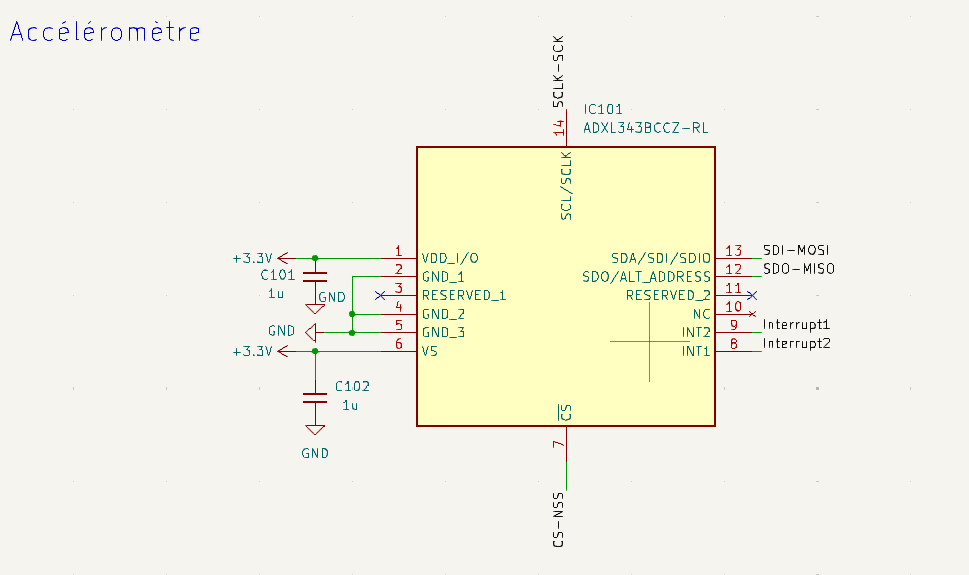

# 2425_ESE_Project_TagBot
Welcome to the TagBot project created by the amazing team consisted of Lucas Chapart, Charlotte Fricot and Marie Caronello.
You may choose the language for the project description.

  
<strong>English description</strong>
  

  ## Introduction
  
  You are currently in the TagBot project (or cat robot), which is part of a class project where each team must design a robot. These robots must be able to play tag together, with a cat and mice, on a table with no edges.
  
  This project involves designing a cat robot which must:
  - Move on a table without edges (without falling off)
  - Be able to change state (cat or mouse)
    - If the robot is a cat, it must be able to catch the mouse
    - If the robot is a mouse, it must be able to escape from the cat
  
  We have several levels of objectives to achieve:
  Level 0: Robot moves + does not fall off the table
  Level 1: Detects another robot and approaches it (cat) or moves away (mouse)
  Level 2: Changes behavior after contact + operates with multiple robots
  Level 3: Capable of self-localization + not affected by obstacles outside the table
  
  ## Microprocessor System
  
  The first 10 sessions are dedicated to creating the PCB, which must be ordered before the All Saints' Day holidays.
  
  Session 1 -> Architectural Diagram / BOM
  Session 2 and 3 -> Annotated Electronic Diagram
  Session 4 -> Corrections to Diagram / Final BOM
  Session 5 -> Placement
  Session 6 -> Corrected Placement
  Session 7 and 8 -> Routing
  Session 9 and 10 -> Routing Corrections, Export
  
  # Code Documentation

[View the documentation](./Documents/Doxygen_Documentation/html/index.html)

  # Lidar X4 Driver
  
  The file `X4_driver.c` provides an implementation to interface with the X4 device via UART communication. This driver supports various functionalities, including starting and stopping scans, retrieving device information and status, and processing scan data. The driver uses a protocol defined in the header file `X4_driver.h` and handles responses from the X4 device.
  
  - **STM32 HAL Library** for UART communication.
  - **Standard C Libraries** (string.h, math.h, stdlib.h, stdbool.h).
  
  

    
<strong>Header File X4_driver.h</strong>

  
    ## Header File: `X4_driver.h`
  
    ### Macros
  
    - **Command Bytes:**
      - `X4_CMD_START` - Start of a command sequence.
      - `X4_CMD_START_SCAN` - Command to start a scan.
      - `X4_CMD_STOP_SCAN` - Command to stop a scan.
      - `X4_CMD_GET_INFO` - Command to get device information.
      - `X4_CMD_GET_HEALTH` - Command to get device status.
      - `X4_CMD_SOFT_RESTART` - Command for a soft restart.
  
    - **Response Protocol:**
      - `X4_RESPONSE_START_SIGN` - Expected start signature of a response.
      - `X4_RESPONSE_SINGLE_MODE` - Single response mode.
      - `X4_RESPONSE_CONTINUOUS_MODE` - Continuous response mode.
  
    - **Response Sizes:**
      - `X4_RESPONSE_HEADER_SIZE` - Size of the response header.
      - `X4_MAX_RESPONSE_SIZE` - Maximum size of the response content.
      - `X4_SERIAL_NUMBER_SIZE` - Size of the serial number.
      - `X4_SERIAL_FIRMWARE_SIZE` - Size of the firmware version.
  
    ### Structures
  
    - **`X4_ResponseMessage`**
      - Contains fields for parsing the response message, including start signature, response length, mode, type code, and content.
  
    - **`X4_DeviceInfo`**
      - Contains fields for device model, firmware version, hardware version, and serial number.
  
    - **`X4_ScanData`**
      - Contains fields for packet header, packet type, sample count, angles, checksum, and dynamically allocated sample data, distances, and angles.
  
    ### Function Prototypes
  
    - **`void X4_StartScan(void);`**
      - Starts a scan on the X4 device.
  
    - **`void X4_StopScan(void);`**
      - Stops the ongoing scan.
  
    - **`void X4_GetDeviceInfo(void);`**
      - Retrieves information about the device.
  
    - **`void X4_GetHealthStatus(void);`**
      - Retrieves the device's status.
  
    - **`void X4_SoftRestart(void);`**
      - Performs a soft restart of the device.
  
    - **`void X4_HandleResponse(void);`**
      - Handles the response received from the X4 device.
  
    - **`void X4_ParseMessage(const uint8_t *raw_data, X4_ResponseMessage *response);`**
      - Parses a raw message into a structured response.
  
    - **`uint16_t convertBytesToUint16(const uint8_t* byte_array);`**
      - Converts a 2-byte array into a 16-bit unsigned integer.
  
  

  
  

    
<strong>Source File: X4_driver.c</strong>

  
    ## Key Functions
  
    - **`static void X4_SendCommand(uint8_t command)`**
      - Sends a command to the X4 device via UART.
  
    - **`void X4_StartScan(void)`**
      - Sends the start scan command and handles the response.
  
    - **`void X4_StopScan(void)`**
      - Sends the stop scan command.
  
    - **`void X4_SoftRestart(void)`**
      - Sends the soft restart command.
  
    - **`void X4_GetDeviceInfo(void)`**
      - Sends the command to get device information and processes the response.
  
    - **`void X4_GetDeviceHealth(void)`**
      - Sends the command to get device status and processes the response.
  
    - **`void X4_HandleDeviceInfoResponse(const X4_ResponseMessage* response)`**
      - Handles and parses the device information response.
  
    - **`void X4_HandleDeviceHealthResponse(const X4_ResponseMessage* response)`**
      - Handles and parses the device status response.
  
    - **`void X4_HandleScanResponse(const X4_ResponseMessage* response)`**
      - Handles and parses the scan data response.
  
    - **`void X4_HandleResponse(void)`**
      - Receives and processes UART data, sending it to the appropriate handler.
  
    - **`void X4_ParseMessage(const uint8_t *raw_data, X4_ResponseMessage *response)`**
      - Parses a raw message into a structured response.
  
    - **`void X4_HandleScanDataDistances(X4_ScanData *scan_data)`**
      - Processes and calculates distances from scan data.
  
    - **`void X4_HandleScanDataAngles(X4_ScanData *scan_data)`**
      - Processes and calculates angles from scan data.
  
    - **`uint16_t calculateXOR(const X4_ScanData *scan_data, size_t packet_length)`**
      - Calculates the XOR of all bytes in the packet, excluding the checksum.
  
    - **`bool verifyCheckCode(const X4_ScanData *scan_data, size_t packet_length)`**
      - Verifies the integrity of the scan data using the checksum.
  
    - **`uint16_t convertBytesToUint16(const uint8_t* byte_array)`**
      - Converts a 2-byte array into a 16-bit unsigned integer.
  

  
  

    
<strong>Usage</strong>

    
    1. **Initialization:**
       - Ensure UART is properly initialized and configured in your main application.
  
    2. **Sending Commands:**
       - Use functions like `X4_StartScan()`, `X4_StopScan()`, and `X4_GetDeviceInfo()` to interact with the X4 device.
  
    3. **Handling Responses:**
       - Call `X4_HandleResponse()` to receive and process responses. Implement appropriate handlers for device information, device status, and scan data.
  
    4. **Processing Scan Data:**
       - Use `X4_HandleScanDataDistances()` and `X4_HandleScanDataAngles()` to process scan data and calculate distances and angles.
  

  
  

    
<strong>Notes</strong>

    ## Notes
  
    - Ensure that the `HAL_UART_Receive` function is configured with an appropriate timeout and error handling as required by your application.
    - Adjust `X4_MAX_RESPONSE_SIZE` in the header file if necessary based on the expected response size from the device.
  

  
  ## Hardware
  
  Most of the hardware has been specified for us, but we need to find our own method to detect the edges to avoid falling off the table. We would like to use IR sensors for this purpose. The sensor will be placed under the robot and will detect the voltage which determines its distance from the ground. When this signal decreases significantly (i.e., the distance increases), it indicates that we are near an edge. Since it will be placed under the robot, we need a sensor capable of detecting small distances, such as the Sharp GP2Y0A21SK0F sensor.
  
  We also want to add a visible LED to indicate the state of our cat robot.

  
<strong>French description</strong>

  # Sommaire
  
1. [Introduction](#introduction)
2. [PCB](#pcb)
3. [Code](#code)

  
  # Introduction
  
  Vous vous trouvez actuellement dans le projet TagBot (ou chat robot), il s'intègre à un projet de classe ou chaque équipe doit concevoir un robot, ces robots doivent pouvoir jouer au chat ensemble, avec un chat et des souris, sur une table sans bords. 
  
  Ce projet est la conception d'un chat robot il doit:
  - se déplacer sur une table sans bord (sans tomber)
  - pouvoir changer d'état (chat ou souris)
    - si le robot est chat il doit pouvoir attraper la souris
    - si le robot est souris il doit pouvoir échaper au chat
  
  Nous avons plusieurs niveaux d'objectifs à atteindre: 
  Niveau 0 : robot se déplace + ne tombe pas de la table
  Niveau 1 : détecte un robot et s'en rapproche (chat) ou s'en éloigne (souris)
  Niveau 2 : change de comportement après un contact + fonctionne avec plusieurs robots
  Niveau 3 : capable de se localiser + n'est pas affecté par les obstacles hors de la table
  
  ## Systeme à microprocessuers
  
  Les 10 premières séances sont consacrées à la création du PCB que l'on doit commander avant les vacances de Toussaint. 
  
  Séance 1 -> Schéma architectural / BOM
  Séance 2 et 3 -> Schéma électronique annoté
  Séance 4 -> Corrections Schéma / BOM Finale
  Séance 5 -> Placement
  Séance 6 -> Placement corrigé
  Séance 7 et 8 -> Routage
  Séance 9 et 10 -> Corrections Routage, export
  
    
  ## Documentation Code

[voir la documentation](./Documents/Doxygen_Documentation/html/index.html)

  ## Le materiel
  
  L'essentiel du materiel nous a été imposé, mais nous devons trouver par nous même le moyen par lequel nous voulons détetecter les bords pour ne pas tomber de la table. 
  Pour cela on aimerait utiliser les capteurs IR ce capteur sera placer sous le robot et recevra donc une tension qui déterminera sa distance par rapport au sol, quand ce signal diminue fortement (donc la distance augmente) cela signifie qu'on est sur un bord. Comme il sera sous le robot il nous faut un capteur qui est capable de detecté des petites distances comme le capteur sharp GP2Y0A21SK0F. 
  
  On aimerai aussi ajouter une led visible qui nous permettrait de savoir quel est l'état de notre robot chat.

  # PCB
  La première étape de la conception de notre PCB a été de réaliser le schéma électronique de notre carte. Voici une liste des composants utilisés :

- **Microprocesseur** : STM32G431CBU6
- **Régulateurs de tension** : 5V et 3.3V
- **Drivers de moteurs** : ZXBM5210-SP-13
- **Système de batterie** : Batterie NIMH 7.2V 1.3Ah 
- **ST Link** : Interface de programmation et débogage
- **Oscillateur Quartz** : 16MHz
- **Connecteurs** : Divers connecteurs pour l'alimentation et les signaux
- **Accéléromètre** : ADXL343

## Détail des Composants et Branchements

### 1. Microprocesseur : STM32G431CBU6

Le microprocesseur STM32G431x6 est au cœur du robot. Il gère la logique du jeu et communique avec les autres composants. Le schéma de branchement du microprocesseur est disponible [ici](./Documents/datasheets/stm32g431cb.pdf).

Les principaux branchements incluent :

- **VDDA** : Connecté à un filtrage LC pour lisser l'alimentation analogique.
- **VSS / VDD** : Alimentations principales.
- **GPIOs** : Utilisés pour le contrôle des LED de débogage et la communication avec les drivers de moteur.

Pour configurer les broches du microcontrôleur, nous utilisons le logiciel CubeIDE. Une fois la configuration effectuée, nous générons le fichier `.ioc` qui documente l'ensemble des options choisies pour chaque pin. Le fait d'utiliser l'ioc du microprocesseur nous permet de choisir au mieux chaque pin pour les entrée/sortie du microprocesseur.

### 2. LED de Debug

Le robot comporte 4 LED : deux vertes, une rouge et une bleue, connectées à des résistances de limitation de courant. Elles indiquent l'état du robot :

- **Rouge** : Indique un état d'erreur.
- **Bleue** : Indique un état de débogage.
- **Vertes** : Indiquent les états de fonctionnement normal.

### 3. Boutons

Le robot dispose de deux boutons :

- **NRST** : Bouton de réinitialisation.
- **Mode** : Permet de changer l'état du robot entre "chat" et "souris".

### 4. Drivers de Moteurs : ZXBM5210-SP-13

Les drivers de moteurs permettent de contrôler les moteurs à courant continu utilisés pour déplacer le robot. Nous utilisons le driver ZXBM5210, connecté selon le schéma de la [documentation](./Documents/datasheets/driver_ZXBM5210.pdf).

Le branchement des drivers inclut :

- **Vref** : Tension de référence pour le contrôle de vitesse.
- **VDD** : Alimentation des moteurs.
- **Entrées de contrôle** : Connectées aux GPIOs du microprocesseur.

### 5. Régulateurs de Tension

Nous utilisons deux régulateurs de tension pour convertir l'alimentation de la batterie :

1. **Régulateur 7.2V → 5V : MP1475S**
   - Construit selon la [documentation](./Documents/datasheets/regulateur_MP1475S.pdf).
   - Assure une tension de 5V en sortie pour l'alimentation du LIDAR et des capteurs de bords.
   - On prend donc la résistance R = 7.68k cette valeur est disponible donc nous pouvons garder la valeur. Si ca n’avait pas été le cas on aurait du réaliser un diviseur de tension pour retrouver les valeurs des résistances pour qu en sortie on est du 5V et 3A.

2. **Régulateur 5V → 3.3V : BU33SD5WG-TR**
   - Construit selon la [documentation](./Documents/datasheets/regulateur_buxxsd5wg-e.pdf).
   - Alimente le microprocesseur et l'écran en 3.3V.

### 6. Oscillateur Quartz 16MHz

L'oscillateur quartz est utilisé pour fournir une horloge stable au microprocesseur. Il est connecté selon le schéma standard, avec des condensateurs de découplage.

### 7. ST Link

La ST Link est utilisée pour la programmation et le débogage du microprocesseur STM32. Elle permet de flasher le code sur le microprocesseur et d'assurer une communication série pour le débogage.

- **VCC** : Alimentation de la ST Link (3.3V).
- **SWDIO / SWCLK** : Broches de communication pour le débogage.
- **NRST** : Connecté au bouton de réinitialisation pour permettre un reset matériel lors de la programmation.

### 8. Accéléromètre : ADXL343

L'accéléromètre ADXL343 permet de mesurer les mouvements du robot. Il est connecté au microprocesseur via une communication **SPI**. La configuration SPI a été choisie car elle offre une communication plus rapide et fiable dans notre application. Le schéma de branchement est basé sur la [documentation](./Documents/datasheets/accelerometre_adxl343.pdf).

### 9. Connecteurs

Le robot dispose de plusieurs connecteurs pour interfacer différents périphériques :

1. **Connecteur Moteurs**

- Les connecteurs moteurs permettent de relier le PCB aux moteurs DC utilisés pour déplacer le robot.
- Chaque connecteur est relié à un driver de moteur ZXBM5210 pour gérer la vitesse et la direction.

2. **Connecteur LIDAR**

- Le connecteur Lidar est utilisé pour interfacer un capteur Lidar au robot, permettant la détection de la distance et des obstacles.
- Il est connecté à l'un des ports de communication du microprocesseur (SPI ou UART).

3. **Connecteur Écran**

- Le connecteur écran permet d'ajouter un petit écrat pour afficher l'état du robot (chat ou souris).
- Ce connecteur est relié à l'interface I2C du microprocesseur.

4. **Connecteur Capteur Bords**

- Le capteur bords est utilisé pour détecter les bords de la table et éviter que le robot ne tombe.
- Le capteur est reié intrinséquement à un DAC

### 10. Batterie

Le robot est alimenté par une batterie LiPo de 7.4V, qui fournit de l'énergie aux régulateurs de tension pour les différents composants du circuit, la documentation utilisé est [ici](./Documents/datasheets/batterie_0900766b81582941.pdf).

  
# Code
  
  ## Pilote Lidar X4
  
  Le fichier `X4_driver.c` fournit une implémentation pour interfacer avec le périphérique X4 via la communication UART. Ce pilote prend en charge diverses fonctionnalités, y compris le démarrage et l'arrêt des analyses, la récupération des informations et de l'état de l'appareil, et le traitement des données d'analyse. Le pilote utilise un protocole défini dans le fichier d'en-tête `X4_driver.h` et gère les réponses du périphérique X4.
  
  - **Bibliothèque STM32 HAL** pour la communication UART.
  - **Bibliothèques C standard** (string.h, math.h, stdlib.h, stdbool.h).
  
  

    
<strong>Fichier header X4_driver.h</strong>

  
  ### Fichier d'en-tête : `X4_driver.h`
  
  #### Macros
  
    - **Octets de Commande :**
      - `X4_CMD_START` - Début d'une séquence de commande.
      - `X4_CMD_START_SCAN` - Commande pour démarrer une analyse.
      - `X4_CMD_STOP_SCAN` - Commande pour arrêter une analyse.
      - `X4_CMD_GET_INFO` - Commande pour obtenir des informations sur l'appareil.
      - `X4_CMD_GET_HEALTH` - Commande pour obtenir l'état de l'appareil.
      - `X4_CMD_SOFT_RESTART` - Commande pour effectuer un redémarrage à chaud.
  
    - **Protocole de Réponse :**
      - `X4_RESPONSE_START_SIGN` - Signature de début attendue d'une réponse.
      - `X4_RESPONSE_SINGLE_MODE` - Mode de réponse unique.
      - `X4_RESPONSE_CONTINUOUS_MODE` - Mode de réponse continue.
  
    - **Tailles des Réponses :**
      - `X4_RESPONSE_HEADER_SIZE` - Taille de l'en-tête de réponse.
      - `X4_MAX_RESPONSE_SIZE` - Taille maximale du contenu de la réponse.
      - `X4_SERIAL_NUMBER_SIZE` - Taille du numéro de série.
      - `X4_SERIAL_FIRMWARE_SIZE` - Taille de la version du firmware.
  
  #### Structures
  
    - **`X4_ResponseMessage`**
      - Contient des champs pour l'analyse du message de réponse, y compris la signature de début, la longueur de la réponse, le mode, le code de type et le contenu.
  
    - **`X4_DeviceInfo`**
      - Contient des champs pour le modèle de l'appareil, la version du firmware, la version matérielle et le numéro de série.
  
    - **`X4_ScanData`**
      - Contient des champs pour l'en-tête du paquet, le type de paquet, la quantité d'échantillons, les angles, le code de vérification, et des données échantillons, distances et angles allouées dynamiquement.
  
  #### Prototypes de Fonction
  
    - **`void X4_StartScan(void);`**
      - Démarre une analyse sur le périphérique X4.
  
    - **`void X4_StopScan(void);`**
      - Arrête l'analyse en cours.
  
    - **`void X4_GetDeviceInfo(void);`**
      - Récupère les informations sur l'appareil.
  
    - **`void X4_GetHealthStatus(void);`**
      - Récupère l'état de l'appareil.
  
    - **`void X4_SoftRestart(void);`**
      - Effectue un redémarrage à chaud de l'appareil.
  
    - **`void X4_HandleResponse(void);`**
      - Gère la réponse reçue du périphérique X4.
  
    - **`void X4_ParseMessage(const uint8_t *raw_data, X4_ResponseMessage *response);`**
      - Analyse un message brut en une réponse structurée.
  
    - **`uint16_t convertBytesToUint16(const uint8_t* byte_array);`**
      - Convertit un tableau de 2 octets en un entier non signé de 16 bits.
    
  

  
  

    
<strong>Fichier Source : X4_driver.c</strong>

  
  ### Fonctions Clés
  
    - **`static void X4_SendCommand(uint8_t command)`**
      - Envoie une commande au périphérique X4 via UART.
  
    - **`void X4_StartScan(void)`**
      - Envoie la commande de démarrage de l'analyse et gère la réponse.
  
    - **`void X4_StopScan(void)`**
      - Envoie la commande d'arrêt de l'analyse.
  
    - **`void X4_SoftRestart(void)`**
      - Envoie la commande de redémarrage à chaud.
  
    - **`void X4_GetDeviceInfo(void)`**
      - Envoie la commande pour obtenir des informations sur l'appareil et traite la réponse.
  
    - **`void X4_GetDeviceHealth(void)`**
      - Envoie la commande pour obtenir l'état de l'appareil et traite la réponse.
  
    - **`void X4_HandleDeviceInfoResponse(const X4_ResponseMessage* response)`**
      - Gère et analyse la réponse d'information sur l'appareil.
  
    - **`void X4_HandleDeviceHealthResponse(const X4_ResponseMessage* response)`**
      - Gère et analyse la réponse de l'état de l'appareil.
  
    - **`void X4_HandleScanResponse(const X4_ResponseMessage* response)`**
      - Gère et analyse la réponse des données d'analyse.
  
    - **`void X4_HandleResponse(void)`**
      - Reçoit et traite les données UART, les envoie au gestionnaire approprié.
  
    - **`void X4_ParseMessage(const uint8_t *raw_data, X4_ResponseMessage *response)`**
      - Analyse un message brut en une réponse structurée.
  
    - **`void X4_HandleScanDataDistances(X4_ScanData *scan_data)`**
      - Traite et calcule les distances à partir des données d'analyse.
  
    - **`void X4_HandleScanDataAngles(X4_ScanData *scan_data)`**
      - Traite et calcule les angles à partir des données d'analyse.
  
    - **`uint16_t calculateXOR(const X4_ScanData *scan_data, size_t packet_length)`**
      - Calcule le XOR de tous les octets dans le paquet, à l'exception du code de vérification.
  
    - **`bool verifyCheckCode(const X4_ScanData *scan_data, size_t packet_length)`**
      - Vérifie l'intégrité des données d'analyse en utilisant le code de vérification.
  
    - **`uint16_t convertBytesToUint16(const uint8_t* byte_array)`**
      - Convertit un tableau de 2 octets en un entier non signé de 16 bits.
  

  
  

    
<strong>Utilisation </strong>

    
    1. **Initialisation :**
       - Assurez-vous que UART est correctement initialisé et configuré dans votre application principale.
  
    2. **Envoi de Commandes :**
       - Utilisez des fonctions telles que `X4_StartScan()`, `X4_StopScan()` et `X4_GetDeviceInfo()` pour interagir avec le périphérique X4.
  
    3. **Gestion des Réponses :**
       - Appelez `X4_HandleResponse()` pour recevoir et traiter les réponses. Implémentez des gestionnaires appropriés pour les informations sur l'appareil, l'état de l'appareil et les données d'analyse.
  
    4. **Traitement des Données d'Analyse :**
       - Utilisez `X4_HandleScanDataDistances()` et `X4_HandleScanDataAngles()` pour traiter les données d'analyse et calculer les distances et les angles.
  

  
  

    
<strong>Remarques </strong>

    
  ### Remarques
  
    - Assurez-vous que la fonction `HAL_UART_Receive` est configurée avec un délai d'attente approprié et une gestion des erreurs selon les besoins de votre application.
    - Ajustez `X4_MAX_RESPONSE_SIZE` dans le fichier d'en-tête si nécessaire en fonction de la taille de réponse attendue du périphérique.
  

## 

