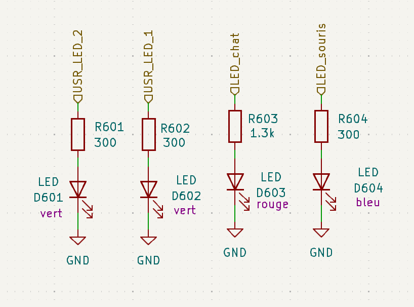
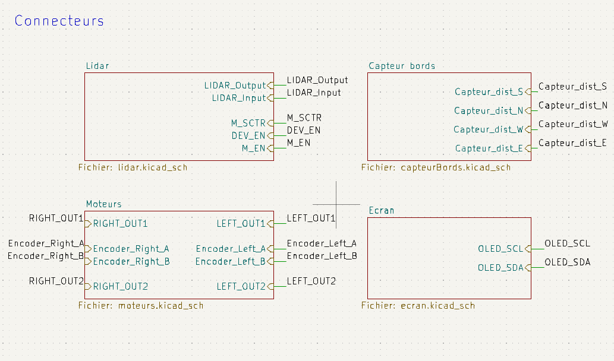
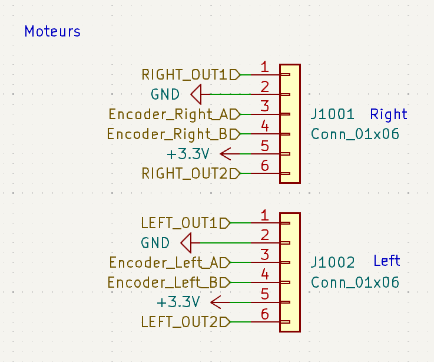
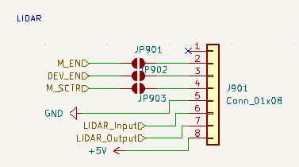
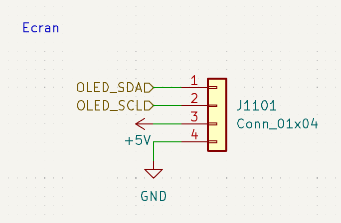
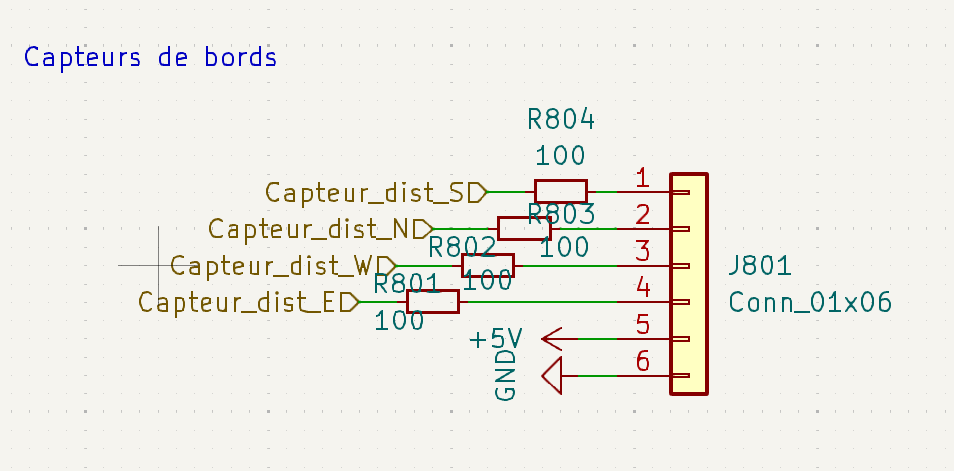
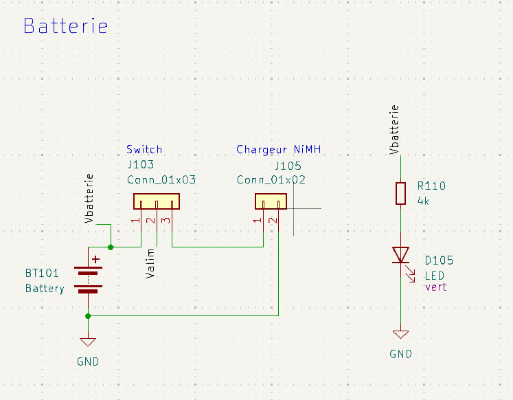

# Table of Contents

1. [Introduction](#introduction)
2. [PCB](#pcb)
3. [Code](#code)

# Introduction

You are currently in the TagBot project (or robot cat), which is part of a class project where each team must design a robot. These robots are meant to play tag together, with a cat and mice, on a table without edges.

At the end of this project, our robot cat must be able to:
- Move on a table without edges (without falling off)
- Change state (cat or mouse)
    - If the robot is a cat, it must be able to catch the mouse
    - If the robot is a mouse, it must be able to escape the cat

We have several levels of objectives to achieve:
- Level 0: Robot moves + does not fall off the table
- Level 1: Detects another robot and either approaches it (cat) or moves away (mouse)
- Level 2: Changes behavior after contact + works with multiple robots
- Level 3: Capable of localizing itself + is unaffected by off-table obstacles

The project is to be completed over a semester, from September to January, with a certain number of deliverables due before each key milestone. The various technical stages include design, development, and validation phases on an embedded system.

<strong>Detailed Plan</strong>

### Before the All Saints' holiday

The first 10 sessions are dedicated to creating the PCB, which must be ordered before the All Saints' holiday.

- Session 1 → Architectural diagram / BOM
- Sessions 2 and 3 → Annotated electronic schematic
- Session 4 → Schematic corrections / Final BOM
- Session 5 → Placement
- Session 6 → Corrected placement
- Session 7 → Routing
- Sessions 8, 9, and 10 → Routing corrections, export

At the same time, we started the software part by creating the project on CubeIDE. We configured the pins and began writing libraries for the different components.

### Between All Saints' and Christmas

This period focuses on software development and integration.

### After the Christmas break

The focus is on the final adjustments and final testing before the presentation. Indeed, the last sessions dedicated to this project will allow us to finalize the strategy algorithms and robotic behaviors. The final challenge will take place on Friday, January 10, which will involve testing and presenting the project where all our class's robot cats will compete.

## Architectural Diagram and Materials

Most of the materials were imposed on us, but we had to find our own method for detecting the edges so as not to fall off the table. 

For this, we would like to use IR sensors. This sensor will be placed under the robot and will receive a voltage that determines its distance from the ground. When this signal drops significantly (i.e., the distance increases), it means we're on an edge. Since it will be under the robot, we need a sensor capable of detecting short distances, like the Sharp GP2Y0A21SK0F sensor.

We would also like to add a visible LED that would allow us to know the state of our robot cat.

# PCB

The first step in designing our PCB was to create the electronic schematic of our board. Here's a list of the components used:

- **Microcontroller**: STM32G431CBU6
- **Voltage regulators**: 5V and 3.3V
- **Motor drivers**: ZXBM5210-SP-13
- **Battery system**: NIMH 7.2V 1.3Ah
- **ST Link**: Programming and debugging interface
- **Quartz oscillator**: 16MHz
- **Connectors**: Various connectors for power and signals
- **Accelerometer**: ADXL343

## Component and Wiring Details

### 1. Microcontroller: STM32G431CBU6

The STM32G431x6 microcontroller is at the heart of the robot. It handles the game logic and communicates with other components. The microcontroller's wiring diagram is available [here](./Documents/datasheets/stm32g431cb.pdf).

The main connections include:
- **VDDA**: Connected to an LC filter to smooth the analog power supply.
- **VSS / VDD**: Main power supplies.
- **GPIOs**: Used for controlling debug LEDs and communicating with the motor drivers.

To configure the microcontroller pins, we use the CubeIDE software. Once the configuration is done, we generate the `.ioc` file, which documents all the options chosen for each pin. Using the microcontroller's IOC file allows us to optimally choose each pin for the microcontroller's input/output.

### 2. LED

The robot has 7 LEDs connected to current-limiting resistors.

- **A red LED**: Indicates that the robot is the cat.
- **A blue LED**: Indicates that the robot is a mouse.
- **Two green LEDs**: These are debug LEDs.
- **A yellow LED**: 5V indicator.
- **A green LED**: 3.3V indicator.
- **A green LED**: 7.2V indicator.

### 3. Buttons

The robot has two buttons:
- **NRST**: Reset button.
- **Mode**: Button to switch the robot's state between "cat" and "mouse."

### 4. Motor Drivers: ZXBM5210-SP-13

The motor drivers control the DC motors used to move the robot. We use the ZXBM5210 driver, connected as per the [documentation](./Documents/datasheets/driver_ZXBM5210.pdf).

The driver connections include:
- **Vref**: Reference voltage for speed control.
- **VDD**: Motor power supply.
- **Control inputs**: Connected to the microcontroller's GPIOs.

### 5. Voltage Regulators

We use two voltage regulators to convert the battery power:

1. **7.2V → 5V Regulator: MP1475S**
   - Built according to the [documentation](./Documents/datasheets/regulateur_MP1475S.pdf).
   - Provides a 5V output to power the LIDAR and edge sensors.
   - To ensure we get 5V, we added a yellow LED connected to a current-limiting resistor.

2. **5V → 3.3V Regulator: BU33SD5WG-TR**
   - Built according to the [documentation](./Documents/datasheets/regulateur_buxxsd5wg-e.pdf).
   - Powers the microcontroller and the display with 3.3V.
   - To ensure we get 3V, we added a green LED connected to a current-limiting resistor.

### 6. 16MHz Quartz Oscillator

The quartz oscillator provides a stable clock for the microcontroller. It is connected according to the standard schematic, with decoupling capacitors.

### 7. ST Link

The ST Link is used for programming and debugging the STM32 microcontroller. It allows us to flash code to the microcontroller and ensure serial communication for debugging.

- **VCC**: Power supply for the ST Link (3.3V).
- **SWDIO / SWCLK**: Communication pins for debugging.
- **NRST**: Connected to the reset button for hardware reset during programming.

### 8. Accelerometer: ADXL343

The ADXL343 accelerometer measures the robot's movements. It is connected to the microcontroller via **SPI** communication. We chose SPI because it offers faster and more reliable communication for our application. The wiring is based on the [documentation](./Documents/datasheets/accelerometre_adxl343.pdf).

### 9. Connectors

The robot has several connectors for interfacing with different peripherals:

1. **Motor Connectors**

- The motor connectors link the PCB to the DC motors used to move the robot.
- Each connector is connected to a ZXBM5210 motor driver for speed and direction control.

2. **LIDAR Connector**

- The Lidar connector is used to interface a Lidar sensor to the robot, allowing for distance and obstacle detection.
- It is connected to one of the microcontroller's communication ports (SPI or UART).

3. **Display Connector**

- The display connector allows the addition of a small screen to show the robot's status (cat or mouse).
- This connector is connected to the I2C interface of the microcontroller.

4. **Edge Sensor Connector**

- The edge sensor is used to detect the table edges and prevent the robot from falling off.
- The sensor is intrinsically connected to a DAC.

### 10. Battery

The robot is powered by a 7.4V LiPo battery, which supplies power to the voltage regulators for various circuit components, the documentation used is [here](./Documents/datasheets/batterie_0900766b81582941.pdf). To ensure we receive a 7.2V voltage, we added a green LED connected to a current-limiting resistor.

  
# Code

  ## Code Documentation

[see the documentation](./Documents/Doxygen_Documentation/html/index.html)
  
  ## Introduction

  In the context of this project, we need to use several communication methods such as SPI for the accelerometer and I2C for the OLED display.
  
  ## Lidar X4 Driver
  
  The `X4_driver.c` file provides an implementation to interface with the X4 device via UART communication. This driver supports various features, including starting and stopping scans, retrieving device information and status, and processing scan data. The driver uses a protocol defined in the `X4_driver.h` header file and handles responses from the X4 device.
  
  - **STM32 HAL library** for UART communication.
  - **Standard C libraries** (string.h, math.h, stdlib.h, stdbool.h).
  
  

    
<strong>X4_driver.h Header File</strong>

  
  ### Header File: `X4_driver.h`
  
  #### Macros
  
    - **Command Bytes:**
      - `X4_CMD_START` - Start a command sequence.
      - `X4_CMD_START_SCAN` - Command to start a scan.
      - `X4_CMD_STOP_SCAN` - Command to stop a scan.
      - `X4_CMD_GET_INFO` - Command to get device information.
      - `X4_CMD_GET_HEALTH` - Command to get device health status.
      - `X4_CMD_SOFT_RESTART` - Command to perform a soft restart.
  
    - **Response Protocol:**
      - `X4_RESPONSE_START_SIGN` - Expected start signature of a response.
      - `X4_RESPONSE_SINGLE_MODE` - Single response mode.
      - `X4_RESPONSE_CONTINUOUS_MODE` - Continuous response mode.
  
    - **Response Sizes:**
      - `X4_RESPONSE_HEADER_SIZE` - Size of the response header.
      - `X4_MAX_RESPONSE_SIZE` - Maximum size of the response content.
      - `X4_SERIAL_NUMBER_SIZE` - Size of the serial number.
      - `X4_SERIAL_FIRMWARE_SIZE` - Size of the firmware version.
  
  #### Structures
  
    - **`X4_ResponseMessage`**
      - Contains fields for parsing the response message, including the start signature, response length, mode, type code, and content.
  
    - **`X4_DeviceInfo`**
      - Contains fields for device model, firmware version, hardware version, and serial number.
  
    - **`X4_ScanData`**
      - Contains fields for packet header, packet type, number of samples, angles, checksum, and dynamically allocated sample data for distances and angles.
  
  #### Function Prototypes
  
    - **`void X4_StartScan(void);`**
      - Starts a scan on the X4 device.
  
    - **`void X4_StopScan(void);`**
      - Stops an ongoing scan.
  
    - **`void X4_GetDeviceInfo(void);`**
      - Retrieves device information.
  
    - **`void X4_GetHealthStatus(void);`**
      - Retrieves device health status.
  
    - **`void X4_SoftRestart(void);`**
      - Performs a soft restart of the device.
  
    - **`void X4_HandleResponse(void);`**
      - Handles the response received from the X4 device.
  
    - **`void X4_ParseMessage(const uint8_t *raw_data, X4_ResponseMessage *response);`**
      - Parses raw data into a structured response.
  
    - **`uint16_t convertBytesToUint16(const uint8_t* byte_array);`**
      - Converts a 2-byte array into an unsigned 16-bit integer.
    
  

  
  

    
<strong>X4_driver.c Source File</strong>

  
  ### Key Functions
  
    - **`static void X4_SendCommand(uint8_t command)`**
      - Sends a command to the X4 device via UART.
  
    - **`void X4_StartScan(void)`**
      - Sends the start scan command and handles the response.
  
    - **`void X4_StopScan(void)`**
      - Sends the stop scan command.
  
    - **`void X4_SoftRestart(void)`**
      - Sends the soft restart command.
  
    - **`void X4_GetDeviceInfo(void)`**
      - Sends the command to get device information and processes the response.
  
    - **`void X4_GetDeviceHealth(void)`**
      - Sends the command to get device health status and processes the response.
  
    - **`void X4_HandleDeviceInfoResponse(const X4_ResponseMessage* response)`**
      - Handles and parses the device information response.
  
    - **`void X4_HandleDeviceHealthResponse(const X4_ResponseMessage* response)`**
      - Handles and parses the device health response.
  
    - **`void X4_HandleScanResponse(const X4_ResponseMessage* response)`**
      - Handles and parses scan data response.
  
    - **`void X4_HandleResponse(void)`**
      - Receives and processes UART data, sending it to the appropriate handler.
  
    - **`void X4_ParseMessage(const uint8_t *raw_data, X4_ResponseMessage *response)`**
      - Parses raw data into a structured response.
  
    - **`void X4_HandleScanDataDistances(X4_ScanData *scan_data)`**
      - Processes and calculates distances from scan data.
  
    - **`void X4_HandleScanDataAngles(X4_ScanData *scan_data)`**
      - Processes and calculates angles from scan data.
  
    - **`uint16_t calculateXOR(const X4_ScanData *scan_data, size_t packet_length)`**
      - Calculates the XOR of all bytes in the packet except the checksum.
  
    - **`bool verifyCheckCode(const X4_ScanData *scan_data, size_t packet_length)`**
      - Verifies scan data integrity using the checksum.
  
    - **`uint16_t convertBytesToUint16(const uint8_t* byte_array)`**
      - Converts a 2-byte array into an unsigned 16-bit integer.
  

  
  

    
<strong>Usage </strong>

    
    1. **Initialization:**
       - Ensure that UART is properly initialized and configured in your main application.
  
    2. **Sending Commands:**
       - Use functions like `X4_StartScan()`, `X4_StopScan()`, and `X4_GetDeviceInfo()` to interact with the X4 device.
  
    3. **Handling Responses:**
       - Call `X4_HandleResponse()` to receive and process responses. Implement appropriate handlers for device information, device health, and scan data.
  
    4. **Processing Scan Data:**
       - Use `X4_HandleScanDataDistances()` and `X4_HandleScanDataAngles()` to process scan data and calculate distances and angles.
  

  
  

    
<strong>Notes </strong>

    
  ### Notes
  
    - Ensure that the `HAL_UART_Receive` function is configured with an appropriate timeout and error handling for your application's needs.
    - Adjust `X4_MAX_RESPONSE_SIZE` in the header file as needed based on the expected response size from the device.
  

## 
